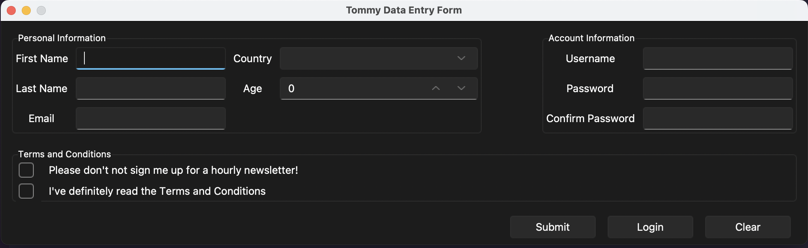

# Tommy Mitchell Data Entry Form

This is my final project for ITEC 352-Software Design For Professor Gumina. 

The form consists of:
- Labels, 
- Entry boxes, 
- Frames, 
- Comboboxes, 
- Spinboxes
- Checkbuttons. 
It's coded entirely in Python using Tkinter.


## Installation

Simply open up the folder and run the code in your favorite IDE.

For the best experience, install the **Sun Valley** theme for tkinter by typing the statement below in the terminal. 

```
  pip install sv-ttk
```
Make sure that you are also running the **Python 3.10** interpreter. You can change this by searching for Python Interpreter in the **Command Pallette**

Don't want to install the theme? That's ok! Simply comment out lines 5 and 11.



## Acknowledgements and Sources

 - [Sun Valley Theme](https://github.com/rdbende/Sun-Valley-ttk-theme)
 - [Editing Lists](https://stackoverflow.com/a/62707453/24402513)
 - [Skip Lines In a CSV File](https://stackoverflow.com/a/9578684/24402513)
 - [Murach’s Python Programming, 2e](https://www.murach.com/shop/murach-s-python-programming-detail)
 - USC PowerPoints

